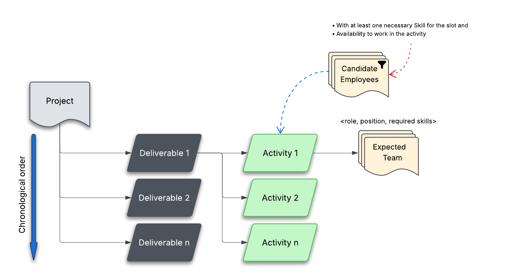

# Alocação Inteligente de Equipes em Propostas Comerciais com LLM e Algoritmo Genético

#### Alunos: [Reynaldo José Henriques da Matta Junior](https://github.com/reynaldo-matta) e [André Carneiro Granville](https://github.com/andre-granville) 
#### Orientadora: [Ana Carolina Alves Abreu](https://github.com/acarolina1612)

---

Trabalho apresentado ao curso [BI MASTER](https://ica.puc-rio.ai/bi-master) como pré-requisito para conclusão de curso.

- [Link para o código do otimizador (program.py)](program.py)
- [Link para o dashboard de visualização](dashboard.html)

---

### Resumo

Toda vez que uma consultoria fecha uma proposta, alguém precisa responder a uma pergunta difícil: quem vai executar o projeto? A resposta exige equilibrar disponibilidade, perfil técnico e custo — e hoje isso é feito, na maior parte das vezes, de forma empírica, com base na experiência e na intuição do gestor.

Este trabalho desenvolve um sistema que automatiza esse processo em duas etapas. Primeiro, um prompt é enviado a um modelo de LLM para analisar um TdR (Termos de referência), que é um documento que descreve o propósito de um projeto, os seus objetivos, escopo (entregáveis) e restrições que servem como guia para o alinhamento de expectativas dos stakeholders. A partir destas informações, o LLM sugere a estrutura de equipe ideal para cada atividade de cada entregável que compõem o escopo do projeto: quantas pessoas são necessárias, o nivel de senioridade sugerido e as competências técnicas necessárias para a boa execução da atividade. Na segunda etapa, um Algoritmo Genético (AG) implementado em Python com a biblioteca DEAP, busca, dentro do quadro de colaboradores da consultoria, a melhor combinação de alocação: quem tem o perfil adequado, quem está disponível nas datas previstas e que resulte no menor custo para o projeto. Se não houver ninguém com o perfil adequado para uma vaga, o sistema identifica essa lacuna e sinaliza a necessidade de contratação de um profissional externo.

Os resultados são apresentados em um dashboard web interativo com gráfico de Gantt e outros detalhes relevantes como por exemplo: as três melhores sugestões de alocação por atividade e um resumo executivo de custo e viabilidade — tudo para que o gestor possa tomar a decisão final com informação completa.

### Abstract

Every time a consulting firm closes a proposal, someone must answer a difficult question: who will execute the project? The answer requires balancing availability, technical profile, and cost — and today this is done, more often than not, empirically, based on the manager's experience and intuition.

This work develops a system that automates this process in two stages. First, a prompt is sent to an LLM to analyze a ToR (Terms of Reference) — a document that describes a project's purpose, objectives, scope (deliverables), and constraints, serving as a guide for aligning stakeholder expectations. From this information, the LLM suggests the ideal team structure for each activity within each deliverable that makes up the project scope: how many people are needed, the recommended seniority level, and the technical competencies required for successful execution. In the second stage, a Genetic Algorithm (GA) implemented in Python using the DEAP library searches the consulting firm's staff roster for the optimal staffing combination: who has the right profile, who is available on the planned dates, and which combination results in the lowest cost to the project. If no one with the appropriate profile is available for a given role, the system identifies this gap and flags the need to bring in an external professional.

The results are presented in an interactive web dashboard with a Gantt chart, and other details as for example: the top-three allocation suggestions per activity, and an executive summary of cost and feasibility — all so the manager can make the final decision with complete information.

---

### 1. Introdução

Imagine que você precisa montar uma equipe para um projeto de 6 meses. Você tem 60 colaboradores na empresa, cada um com um histórico de projetos, um conjunto de competências técnicas e uma agenda parcialmente ocupada. O projeto tem 4 entregáveis, cada um com várias atividades, e cada atividade precisa de um perfil diferente de profissional. Quem você escolhe para cada papel?

Se fizer isso manualmente, vai passar horas olhando para planilhas, perguntando para os recursos e seus superiores quem está livre, e provavelmente vai acabar escolhendo as mesmas pessoas de sempre — porque são as que você conhece bem. O resultado pode ser tecnicamente funcional, mas dificilmente é ótimo.

Esse é o problema que este trabalho resolve.

A ideia central é tratar a montagem de equipes como o que ela realmente é: um **problema de otimização combinatória**. O espaço de possibilidades é enorme — para cada vaga, há vários candidatos; para cada candidato, há restrições de agenda; para cada cargo, há requisitos de perfil. Explorar esse espaço de forma inteligente é exatamente o que um Algoritmo Genético faz bem.

O sistema foi desenvolvido com duas frentes integradas:

1. **A LLM como analista de proposta**: dado o texto da proposta, o modelo de linguagem sugere a estrutura de equipe para cada atividade — quantas pessoas, com quais cargos e quais competências técnicas. Isso resolve o ponto de partida: saber o que se está procurando antes de procurar.

2. **O AG como otimizador de alocação**: com a estrutura definida, o Algoritmo Genético varre o quadro real de colaboradores e encontra a combinação que melhor preenche as vagas, respeitando disponibilidade de agenda, aderência de perfil e custo. Quando não existe candidato interno para uma vaga, o sistema diz isso claramente — em vez de esconder o problema.

O resultado é exibido em um dashboard interativo que mostra o Gantt do projeto, as melhores sugestões de equipe por atividade e um panorama geral de custo e viabilidade.

---

### 2. Modelagem

#### 2.1 Como o sistema funciona — visão geral da arquitetura

O sistema tem três peças que trabalham em sequência:

```
Proposta comercial
       ↓
  Backend (.NET) (Esse codigo não foi disponibilizado, mas temos alguns inputs na pasta para validar o restante que está sendo entregue)
  ├── Faz chamadas a conectores de dados que estão vinculados a Sistemas de Informação usados pela empresa, como o Team guide e o Asana, para a extração dos dados cadastrais dos colaboradores (Team Guide) e os dados dos projetos em andamentos (Asana).
  ├── Salva os dados em uma estrutura relacional, no banco de dados PostGreSQL
  ├── Chama a LLM para analisar uma proposta de projeto → define estrutura de equipe (vagas + perfis)
  ├── Consulta a timeline dos colaboradores → calcula dias livres por atividade
  └── Monta o arquivo InputData.json, contendo os dados de entrada pertinentes para o otimizador (com base nos dados que estão no PostGreSQL)
       ↓
  Otimizador Python (program.py)
  └── Executa o AG por atividade → gera o arquivo OutputData.json
       ↓
  Dashboard (dashboard.html)
  └── Lê o OutputData.json e exibe os resultados da otimização.
```

O **backend** cuida da integração com a realidade da empresa: quem são os colaboradores, o que cada um sabe fazer, e quais dias estão ocupados com outros projetos. Ele entrega tudo isso organizado para o otimizador.

O **otimizador** não precisa saber nada do sistema da empresa — ele recebe um arquivo JSON limpo e devolve as melhores alocações. Isso o torna simples de testar e rodar até no Google Colab.

O **dashboard** transforma o JSON de resultado numa visualização navegável, sem precisar de servidor ou instalação de programas da empresa.

#### 2.2 O arquivo InputData.json 

O arquivo de entrada foi projetado para ser **autocontido**, ou seja, ele contem todos os dados necessários para o otimizador  executar, sem a necessidade de consultar mais nenhuma fonte de dados. Cada entregável do projeto (`deliverables`), contêm um ou mais atividades (`activities`) e, cada atividade, uma ou mais vagas que precisam ser preenchidas (`expected_team`). Cada atividade inclue também uma lista pré-filtrada de colaboradores aptos a preencher a vaga  (`candidate_employees`), incluindo quais dias de trabalho estão disponíveis. Ao final do arquivo, uma tabela relaciona o cargo, com o nível hierárquico e o custo homem hora.  

**InputData.json** - Visão geral da estrutura de dados 



**InputData.json** - Conteúdo do aquivo

```json
{
  "proposal": {
    "title": "Nome do projeto",
    "project_start_date": "2026-05-11",
    "deadline_in_days": 190,
    "deliverables": [
      {
        "deliverable_order": 1,
        "deliverable_name": "Kickoff & Requirements Document",
        "deadline_in_days": 15,
        "activities": [
          {
            "name": "Project kickoff and stakeholder alignment",
            "estimated_duration_days": 3,
            "expected_team": [
              {
                "role": "Project Manager",
                "position": "Team Leader",
                "macro_skills": ["Project and Program Management"],
                "estimated_person_days": 3
              }
            ],
            "candidate_employees": [
              {
                "id": "colaborador@empresa.com",
                "name": "Nome do Colaborador",
                "position": "Team Leader",
                "macro_skills": ["Project and Program Management"],
                "free_days": [1, 2, 3],
                "free_days_date_format": ["2026-05-11", "2026-05-12", "2026-05-13"]
              }
            ]
          }
        ]
      }
    ]
  },
  "position_order": [
    { "name": "Intern", "order": 1, "hourly_cost": 6.00 },
    { "name": "Team Leader", "order": 7, "hourly_cost": 80.00 }
  ]
}
```


#### 2.3 Como o Algoritmo Genético enxerga o problema

O AG funciona como um processo de seleção natural: começa com um grupo de soluções aleatórias e, ao longo de gerações, vai cruzando e mutando as melhores até convergir para uma solução de boa qualidade.

Mas antes de entender como ele evolui, é preciso entender como ele **representa** uma solução.

**O cromossomo**

Cada "solução" para uma atividade é representada por uma lista de números inteiros — o cromossomo. Cada posição da lista, o gene, corresponde a uma vaga da atividade, e o número nessa posição indica qual candidato foi escolhido:

```
Vaga 0: candidatos [Alice, Bob, Carlos]       → gene = 0 (Alice), 1 (Bob), 2 (Carlos) ou 3 (terceirizar)
Vaga 1: candidatos [Diana, Eduardo]           → gene = 0 (Diana), 1 (Eduardo) ou 2 (terceirizar)
Vaga 2: candidatos [Fernanda, Guto, Helena]   → gene = 0, 1, 2 ou 3 (terceirizar)

Cromossomo [1, 0, 2] = Bob para vaga 0, Diana para vaga 1, Guto para vaga 2
Cromossomo [3, 1, 3] = terceirizar vaga 0, Eduardo para vaga 1, terceirizar vaga 2
```

O número extra no final de cada lista representa a opção de **terceirização** — ela sempre existe, mas custa muito mais (3× o custo base), então o AG a usa apenas quando não há candidato interno viável.

**O pré-filtro — quem entra na lista de candidatos**

Antes de o AG começar, o sistema já filtra quem pode ser candidato de cada vaga. Para entrar na lista, o colaborador precisa:
1. Ter ao menos uma competência técnica (macro skill) em comum com as exigidas pela vaga.
2. Ter dias úteis livres suficientes no período da atividade.

Quem não passa por esse filtro simplesmente não aparece como opção — reduzindo o espaço de busca e evitando avaliações desnecessárias.

#### 2.4 A função de custo — como o AG avalia cada solução

Para o AG saber se uma solução é boa ou ruim, ele precisa calcular um custo para ela. Quanto menor o custo, melhor a alocação.

O custo de cada vaga é calculado assim:

- **Candidato interno disponível:**
  ```
  custo = max(custo_base_candidato, custo_base_da_vaga) × dias_necessários × penalidade_skill × penalidade_posição
   ```
  
  onde:
  
  custo_base_candidato: custo diário (custo homen/hora * 8 horas) do candidato, de acordo com o seu cargo (posição) na empresa. 
  
  custo_base_da_vaga: custo diário (custo homen/hora * 8 horas) de acordo com o cargo sugerido pela LLM.  
 
- **Sem candidato — terceirização:**
  ```
  custo = custo_base_da_vaga × dias_necessários × 3,0

  onde:
  3,0: penalização 
  ```

O `max(custo_base_candidato, custo_base_da_vaga)` existe por um motivo importante: sem ele, um colaborador júnior (mais barato) alocado numa vaga sênior pareceria vantajoso apenas pelo custo baixo — o que seria uma decisão ruim. Ao usar o custo mínimo esperado para aquela vaga como piso, o sistema garante que qualquer desvio de perfil só pode encarecer, nunca baratear artificialmente.

**As penalidades** funcionam como multiplicadores sobre esse custo base:

| Situação | Penalidade de Skill | Penalidade de Posição |
|---|---|---|
| Match perfeito — perfil e todas as skills | × 1,0 | × 1,0 |
| 2 skills exigidas, só 1 atendida | × 2,0 | × 1,0 |
| 1 nível de senioridade abaixo do exigido | × 1,0 | × 1,5 |
| 2 níveis abaixo | × 1,0 | × 2,0 |
| Acima do nível (overqualified) | × 1,0 | × 1,0 — o custo maior já penaliza |
| Terceirização | — | × 3,0 sobre o custo base |

A penalidade de skill é calculada como `total de skills exigidas ÷ skills atendidas` — quanto mais incompleto o match, mais caro fica. A de posição cresce 0,5 por nível de senioridade abaixo do exigido.

**Desempate:** quando duas soluções têm custo exatamente igual, o sistema prefere a que terceiriza menos vagas, somando um delta mínimo de `0,001 × número de vagas terceirizadas` ao custo. É pequeno demais para inverter uma decisão real, mas suficiente para desempatar com critério.

#### 2.5 Como o AG evolui — os operadores genéticos

A evolução acontece ao longo de gerações, usando quatro mecanismos:

**Seleção por torneio:** para escolher quem vai "se reproduzir", o AG sorteia 3 indivíduos e seleciona o de menor custo.

**Cruzamento uniforme:** dois "pais" são combinados gene a gene, com 50% de chance de cada gene vir de um ou do outro. O resultado são dois "filhos" com combinações novas dos candidatos escolhidos pelos pais. 

**Mutação por gene:** após o cruzamento, cada gene tem 30% de chance de ser substituído por um candidato aleatório. 

**Reparação de duplicatas:** cruzamento e mutação podem gerar cromossomos inválidos — por exemplo, o mesmo colaborador alocado em duas vagas da mesma atividade ao mesmo tempo. A função `repair_duplicates()` resolve isso imediatamente após cada operação: encontra o conflito, tenta substituir por outro candidato disponível e, se não houver alternativa, marca a vaga para terceirização. O AG nunca avalia uma solução inválida.

**Os hiperparâmetros escolhidos:**

| Parâmetro | Valor | Observação |
|---|---|---|
| Tamanho da população | 80 |  |
| Gerações | 150 |  |
| Probabilidade de cruzamento | 70% |  |
| Probabilidade de mutação (por indivíduo) | 30% |  |
| Probabilidade de mutação (por gene) | 30% |  |
| Torneio | 3 competidores |  |
| Hall of Fame | Top 3 por atividade | Retorna as 3 melhores soluções para o gestor comparar. |
| Semente aleatória | 42 (fixa) | Garante que a mesma entrada sempre produza o mesmo resultado. |

**Por que rodar o AG por atividade, e não para o projeto inteiro de uma vez?**

Rodar um único AG para todo o projeto tornaria o cromossomo enorme e o espaço de busca combinatoriamente intratável. Mais importante: os candidatos de cada atividade já são diferentes (calculados com base na janela de tempo daquela atividade), então cada atividade é, na prática, um problema independente. Rodar por atividade permite também que as execuções sejam paralelizadas no futuro — cada uma é completamente autônoma.

---

### 3. Resultados

Os cenários abaixo foram executados com o `program.py` pelo projeto em C#.net e também pelo Google Colab. Cada um tem seu próprio `InputData.json` e `OutputData.json`.

---

#### 🧪 Caso de estudo 1 — Proposta de desenvolvimento do Portal de Mercado de Energia LAC

**O projeto:** Desenvolver um portal web de análise de mercados de energia elétrica para a América Latina e Caribe (LAC). O trabalho envolve pesquisa de mercados regionais e internacionais, desenvolvimento de um portal interativo com mapa-múndi, módulos de visualização de dados e entrega de relatórios técnicos em fase.

**Configuração:**

| Parâmetro | Valor |
|---|---|
| Data de início | 11/05/2026 |
| Prazo total | 120 dias úteis |
| Número de entregáveis | 4 |
| Número de atividades de todos os entregáveis  | 15 |
| Número de vagas para todas as atividades | 35 |

**Entregáveis:**

| # | Nome | Prazo (dias úteis) |
|---|---|---|
| 1 | Kickoff & Requirements Document (DR) | 15 |
| 2 | First Partial Report – Energy Market Analysis | 50 |
| 3 | Second Partial Report – Portal Design, Architecture & Prototype | 75 |
| 4 | Final Report & Portal Delivery | 50 |

**Resultado:**

| Métrica | Valor |
|---|---|
| Fitness Score | 0,544 |
| Duração do projeto | **120 dias úteis** |
| Custo real total | **USD 62.624,00** |
| Vagas alocadas internamente | **34 de 35** (97,1%) |
| Vagas com necessidade de contratação externa | 1 |
| Vagas ocupadas por colaboradores subqualificados (menos skills que as necessárias) | 21 |
| Vagas ocupadas por colaboradores em posição hierárquica inferior a requerida | 6 |


**O que o Fitness Score de 0,544 significa:** o custo ideal seria aquele em que cada vaga fosse preenchida por um candidato com match perfeito de cargo e todas as skills. O fitness é calculado como `custo_ideal ÷ custo_penalizado_total` — quanto mais próximo de 1,0 mais perfeita a alocação. O score obtido de 0,544 é explicado pelo alto número de vagas preenchidas
por colaboradores subqualificados, ou seja, com menos skills que a requerida pela vaga (21 de 35 vagas), pelo número de vagas preenchidas por colaboradores em posição hierárquica inferior a requerida (6 de 35 vagas) e uma vaga que não foi preenchida.    

**A única lacuna:** na atividade de pesquisa de mercados regionais, o sistema não encontrou nenhum colaborador com perfil de Lead Analyst que tivesse as macrocompetências exigidas e disponibilidade no período. O sistema sinalizou isso claramente — em vez de alocar alguém inadequado silenciosamente.

> 📂 Arquivos: [`Case 1/InputData.json`](Case%201/InputData.json) | [`Case 1/OutputData.json`](Case%201/OutputData.json) | [`Case 1/proposal.json`](Case%201/proposal.json)

---

#### 🧪 Caso de estudo 2 — Support to the Implementation of the More Lights for the Amazon Program

**O projeto:** Desenvolver um plano ótimo de eletrificação georreferenciado para facilitar o acesso universal à energia elétrica em áreas remotas e isoladas da Amazônia Legal (Amazonas, Acre, Pará e Roraima), por meio da identificação e caracterização dos beneficiários, bem como da determinação das soluções de eletrificação fora da rede elétrica convencional (off-grid) de menor custo, utilizando sistemas fotovoltaicos individuais e minirredes fotovoltaicas (PV mini-grids).


**Configuração:**

| Parâmetro | Valor |
|---|---|
| Data de início | 05/06/2026 |
| Prazo total | 270 dias úteis |
| Número de entregáveis | 5 |
| Número de atividades de todos os entregáveis  | 9 |
| Número de vagas para todas as atividades | 20 |

**Entregáveis:**

| # | Nome | Prazo (dias úteis) |
|---|---|---|
| 1 | Inception Report and Detailed Work Plan | 30 |
| 2 | Beneficiary Georeferenced Database | 60 |
| 3 | Baseline Energy Demand Assessment | 30 |
| 4 | Preliminary Universal Access Plan | 90 |
| 5 | Final Universal Access Plan | 60 |


**Resultado:**

| Métrica | Valor |
|---|---|
| Fitness Score | 0,655 |
| Duração do projeto | **270 dias úteis** |
| Custo real total | **USD 241.520,00** |
| Vagas alocadas internamente | **20 de 20** (100%) |
| Vagas com necessidade de contratação externa | 0 |
| Vagas ocupadas por colaboradores subqualificados (menos skills que as necessárias) | 9 |
| Vagas ocupadas por colaboradores em posição hierárquica inferior a requerida | 2 |

**O que o Fitness Score de 0,655 significa:** o custo ideal seria aquele em que cada vaga fosse preenchida por um candidato com match perfeito de cargo e todas as skills. O fitness é calculado como `custo_ideal ÷ custo_penalizado_total` — quanto mais próximo de 1,0 mais perfeita a alocação. O score obtido de 0,655 , um pouco melhor do que o obtido com relação ao Caso 1, é explicado pelo preenchimento de todas as vagas, sem a necessidade de contratação de colaboradores externos, pelo número menor de vagas preenchidas por colaboradores subqualificados (9 de 20 ) e pelo menor número de vagas prrenchidas por colaboradores em posição hierárquica inferior a requerida (2 de  20).  


> 📂 Arquivos: [`Case 2/InputData.json`](Case%202/InputData.json) | [`Case 2/OutputData.json`](Case%202/OutputData.json) | [`Case 2/proposal.json`](Case%202/proposal.json)


---

#### Resumo dos casos de estudo

| Caso de estudo | Vagas Totais | Alocadas Internamente | Terceirizadas | Custo Real (USD) | Fitness Score | 
|---|---|---|---|---|---|
| 1 - Portal LAC | 35 | 34 (97,1%) | 1 | 62.624,00 | 0,544 |
| 2 - Support to the Implementation of the More Lights for the Amazon Program| 20 | 20 (100%) | 0 | 241.520 | 0,655 |


---

### 4. Conclusões

O sistema funcionou. Em casos reais com dezenas de vagas, múltiplos entregáveis e uma base de colaboradores com disponibilidades parciais, o AG encontrou alocações em que mais de 97% das vagas foram preenchidas internamente, para o caso de estudo 1, e 100% para o segundo caso de estudo. Também identificou com clareza as que não puderam ser.

Mas além do resultado numérico, o que o trabalho demonstrou foi algo mais amplo: é possível tratar a montagem de equipes como um problema de otimização estruturado, com representação clara, função de custo bem definida e restrições explícitas. Isso transforma uma decisão que hoje depende exclusivamente da memória e intuição do gestor numa decisão apoiada por dados — sem tirar do gestor a palavra final.

**O que o sistema entrega de concreto:**

- **Velocidade**: o que levaria horas de consultas e planilhas é calculado em segundos.
- **Transparência**: o gestor vê não apenas a melhor sugestão, mas as três melhores por atividade, com custos reais e penalizados detalhados — podendo escolher com critério.
- **Identificação de lacunas**: vagas sem candidato interno aparecem explicitamente no resultado, permitindo que a empresa decida conscientemente se contrata externamente, renegocia o escopo ou declina da proposta.
- **Reprodutibilidade**: com semente aleatória fixa, o mesmo InputData sempre gera o mesmo OutputData — essencial para auditar decisões e comparar cenários.

**O que pode melhorar:**

- A qualidade do resultado depende diretamente da qualidade do cadastro de competências dos colaboradores. Perfis incompletos levam a matches parciais que poderiam ser mais precisos.
- O AG otimiza cada atividade de forma independente. Uma extensão natural seria considerar interdependências entre atividades paralelas — o mesmo colaborador alocado em duas atividades que se sobrepõem no tempo, por exemplo.
- Os hiperparâmetros foram definidos empiricamente. Para projetos muito maiores (centenas de vagas), uma busca sistemática de hiperparâmetros poderia melhorar a convergência.

---

### Como Executar

#### Google Colab (recomendado)

1. Abra o `program.py` no [Google Colab](https://colab.research.google.com/).
2. Execute: `pip install deap`
3. Quando solicitado, faça upload do `InputData.json` do cenário desejado.
4. Baixe o `OutputData.json` gerado ao final.
5. Abra o `dashboard.html` no Chrome e selecione o arquivo de output baixado junto com o program.py e o arquivo de input na mesma pasta.

#### Execução local

```bash
pip install deap
python program.py
# Ajuste INPUT_FILE e OUTPUT_FILE no topo do main() para os caminhos desejados
```

Após a execução, abra `dashboard.html` no Chrome e selecione o arquivo de output baixado junto com o program.py e o arquivo de input na mesma pasta.

---

Matrícula André Carneiro Granville: 232.100.380

Matrícula Reynaldo José Henriques da Matta Junior: 232.100.400


Pontifícia Universidade Católica do Rio de Janeiro

Curso de Pós Graduação *Business Intelligence Master*
